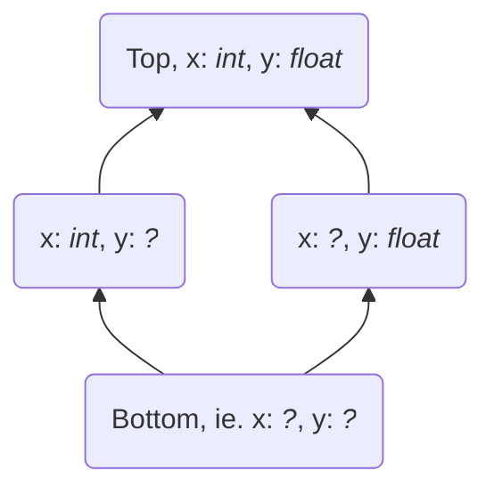
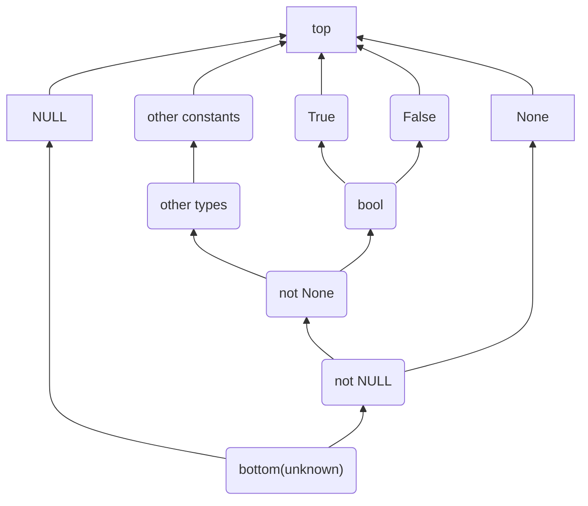

# The Tier 2 Redundancy Eliminator

Author: Ken Jin, Mark Shannon

Tier 2 traces require optimization. At minimum, redundant operations
should be removed. This is where the name "Redundancy Eliminator" is
derived from. This forms part of the larger effort towards
the tier 2 optimizer.

## Abstract Interpretation of Uops

To analyze the uops, we use
[abstract interpretation](https://en.wikipedia.org/wiki/Abstract_interpretation).

Just like the CPython interpreter is an interpretation over
Python program state, represented by `PyObject *`, the abstract interpreter
shall be an interpretation over Python symbolic information state,
represented by `_Py_UOpsSymType *`.

The abstract interpreter has the equivalent constructs of the
CPython interpreter to represent state. It has symbolic
local and symbolic frames. This allows it to emulate CPython
runtime state accurately.

Executing "steps" in the abstract interpreter is thus similar to
doing the same in CPython -- by interpreting bytecode instructions.
The abstract interpreter thus "executes" a bytecode, update its
symbolic state, and repeats until it reaches a terminator (the end
of the trace).

### Lattice

**Note: if you are uninterested in the theory behind data-flow analysis,\
please skip this section.**

The states of information in such an abstract interpretation can be
represented by a [lattice](https://en.wikipedia.org/wiki/Lattice_(order))
of values. The lattice itself is an ordered powerset
of all variables and their associated information.

For example, here is a trivial lattice for the statement 
```python
x = 1
y = 2.0
```
:



Real Python runtime information
may contain more complex types, constants, and unions of types.

Each `_Py_UOpsSymType` captures all the information associated
with a variable at any point in the lattice. For example, it contains
type information stored as a bitmask, and constant values.

For more information regarding lattices in compiler theory,
Page 27 onwards of this presentation provides a gentle introduction
https://ilyasergey.net/CS4212/_static/lectures/PLDI-Week-12-dataflow.pdf
Credits to the courses UPenn Compilers (CIS 341) and NUS Compiler
Design (CS4212).

The hiearchy of types in the type system can also be represented
by a lattice. Roughly, it looks like this:



The `others` corresponds to CPython's own type system.

### Abstract DSL

A extra specification that overrides the original cases in
`Python/bytecodes.c` is used.
This generates an abstract interpreter that operates on these symbolic values.
Where there is no overridden case, the generator falls back to a generic
version where all output stack values are unknown symbolic values.

```
// Python/bytecodes.c
op(OP, (arg1 -- out)) {
    eggs();
}
```
```
// Python/tier2_redundancy_eliminator_bytecodes.c
// Nothing to see here :).
```
```
// Python/abstract_interp_cases.c.h
case OP: {
    _Py_UOpsSymType *out;
    out = sym_init_unknown(ctx);
    if (out == NULL) goto error;
    stack_pointer[-1] = out;
    break;
}
```

Where this is an overridden case, all information from the overridder
takes precedence. For example:

```
// Python/bytecodes.c
op(OP, (arg1 -- out)) {
    out = eggs(arg1);
}
```
```
// Python/tier2_redundancy_eliminator_bytecodes.c
op(OP, (arg1 -- out)) {
    out = spam(arg1);
}
```
```
// Python/abstract_interp_cases.c.h
case OP: {
    _Py_UOpsSymType *arg1;
    _Py_UOpsSymType *out;
    arg1 = stack_pointer[-1];
    out = spam(arg1);
    stack_pointer[-1] = out;
    break;
}
```


