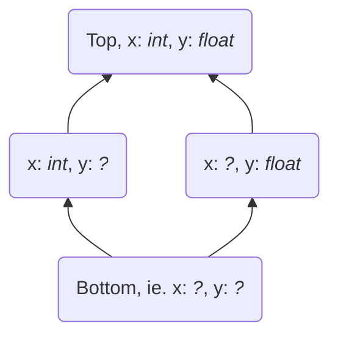

# The Tier 2 Redundancy Eliminator

Author: Ken Jin, Mark Shannon

Tier 2 traces require optimization. At minimum, redundant operations
should be removed. This is where the name "Redundancy Eliminator" is
derived from. This forms part of the larger effort towards
the tier 2 optimizer.

## Abstract Interpretation of Uops

To analyze the uops, [abstract interpretation](https://en.wikipedia.org/wiki/Abstract_interpretation)
shall be used.

Just like the CPython interpreter is an interpretation over
Python program state, represented by `PyObject *`, the abstract interpreter
shall be an interpretation over Python symbolic information state,
represented by `_Py_UOpsSymType *`.

### Lattice

The states of information in such an abstract interpretation can be
represented by a [lattice](https://en.wikipedia.org/wiki/Lattice_(order))
of values. The lattice itself is an ordered powerset
of all variables and their associated information.

For example, here is a trivial lattice for the statement 
```python
x = 1
y = 2.0
```
:



This example is intentionally contrived. Real Python runtime information
may contain more complex types, constants, and unions of types.

Each `_Py_UOpsSymType` thus captures all the information associated
with a variable at any point in the lattice.

### Abstract DSL Generator

A DSL that overrides the original cases in `Python/bytecodes.c` is used.
This generates an abstract interpreter that operates on these symbolic values.
Where there is no overidden case, the generator falls back to a generic
version where all output stack values are unknown symbolic values.
For example:

```
// Python/bytecodes.c
pure op(OP, (arg1 -- out)) {
    spam();
}
```
```
// Python/tier2_redundancy_eliminator_bytecodes.c
pure op(OP, (arg1 -- out: &PYFLOAT_TYPE)) {
    spam();
}
```
```
// Python/abstract_interp_cases.c.h
case OP: {
    _Py_UOpsSymType *out;
    out = sym_init_unknown(ctx);
    if (out == NULL) goto error;

    sym_set_type(out, PYLONG_TYPE, 0);
    stack_pointer[0] = out;
    stack_pointer += 1;
    break;
}
```

Note the use of the type annotation in the DSL. It is used to automatically
set the symbolic type of a value.


