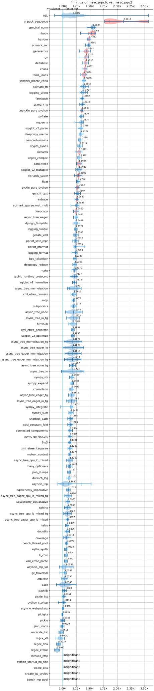

# Plan for 3.15

## Performance

### The Just-In-Time (JIT) compiler

* Merge top-of-stack caching
* Trace recording
* Reference count elimination
* LLVM 21 upgrade

### Tail-calling interpreter is distributed with macOS and (hopefully) Windows

The tail-calling interpreter provides a 5% speedup on pyperformance over 
macOS according to benchmarks from Thomas Wouters. Ken Jin's
communications with Ned Deily suggest that the tail calling-interpreter 
should be distributed by default in macOS binaries.

On Windows, the tail-calling interpreter provides a 15-20% speedup on pyperformance (depending on processor) for Visual Studio 18.
On a AMD Ryzen 5800X measured
machine by Chris Eibl, the [results](https://gist.github.com/chris-eibl/fade55faaad97e2cd12f5587ac1f4aa0) show a range of -11--55% speedups on
the individual benchmarks.

We will work with Steve Dower to hopefully distribute the Windows binaries
for 3.15 with tail-calling enabled on MSVC.
